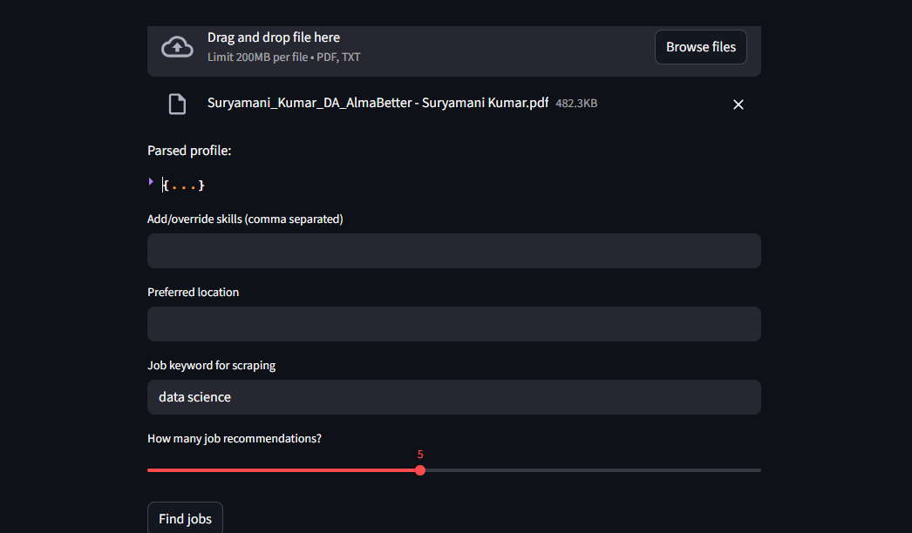
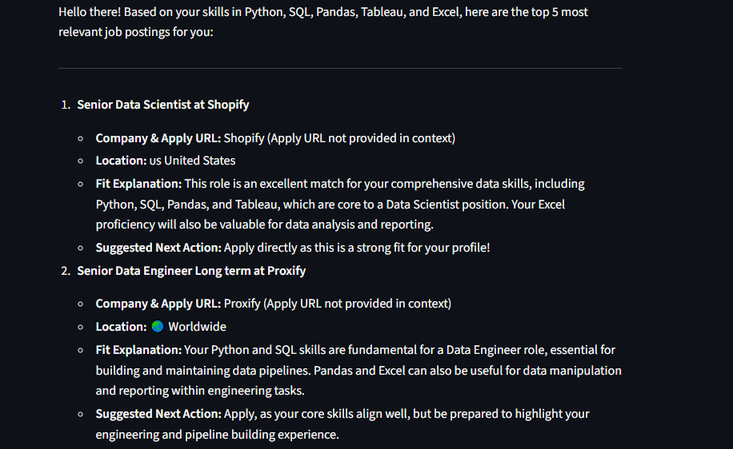

# Job Recommender

## Project Description
The Job Recommender is a Python-based application that scrapes job listings from LinkedIn and provides personalized job recommendations. It uses Playwright for browser automation to authenticate and scrape jobs, stores job data locally, and optionally serves recommendations via a Streamlit web app.

This project automates job discovery by scraping relevant jobs based on your search preferences, managing authentication securely with saved cookies, and enabling an easy-to-use interactive interface.

---

## Features
- Automated LinkedIn login and cookie management to maintain session without repeated manual login.
- Scrapes job listings from LinkedIn based on search terms and location.
- Stores scraped jobs in CSV format for easy analysis or indexing.
- Optional Streamlit app integration to browse and get job recommendations interactively.
- Seamless subprocess integration for authentication and scraping within the app UI.
- Handles cookie expiry gracefully by re-authentication when needed.
- Easily customizable job search filters and scraping parameters.

---

## How to Run

### 1. Clone the repository and navigate to project folder:
```bash
git clone <your-repo-url>
cd job-recommender

### 2. Unlocking Virtual enviroment:
venv\Scripts\activate

### 3. Installing prerequisites and libraries in virtual enviroment:
pip install -r requirements.txt
playwright install

### Run the Streamlit app to interactively explore recommendations:
Streamlit run app.py

---

## Sample Input\Output

- Upload the resume to 'Browse files' --> Data Science Resume
- Give the job Post --> 'Data Science'
- Optional you can input skills or location to search job

- Click on Find jobs

### Output

- 1. Senior Data Scientist at Shopify

- Company & Apply URL: Shopify (Apply URL not provided in context)
- Location: 🇺🇸 United States
- Fit Explanation: This role is an excellent match for your comprehensive data skills, including      Python, SQL, Pandas, and Tableau, which are core to a Data Scientist position. Your Excel proficiency will also be valuable for data analysis and reporting.
- Suggested Next Action: Apply directly as this is a strong fit for your profile!

- 2. Senior Data Engineer Long term at Proxify

- Company & Apply URL: Proxify (Apply URL not provided in context)
- Location: 🌏 Worldwide
- Fit Explanation: Your Python and SQL skills are fundamental for a Data Engineer role, essential for building and maintaining data pipelines. Pandas and Excel can also be useful for data manipulation and reporting within engineering tasks.
- Suggested Next Action: Apply, as your core skills align well, but be prepared to highlight your engineering and pipeline building experience.

---

## Screenshot





